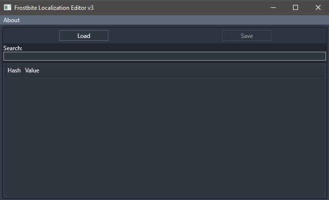

# FbLocalization
FbLocalization is an application to view and edit localization binary chunk files from games built with the Frostbite game engine.

This will provide only the base functionality for reading and writing the modified binary chunk. A better way would be to include the histogram chunk and proper encoding support, but for this demo project it's enough for now.

This may or may not work with latest Frostbite games.

# Features
- View and Edit localization entries
- Export localization entries as binary chunk file or CSV

# Requirements

## Building the source
- .NET 5.0
- .NET Standard 2.0

## Launching the Application
Depending on the compilation mode:
- .NET 5.0 runtime

# Project structure

- **src/** - contains all projects and source files
    - **FbLocalization/** - main WPF application
        - **Command/** - all application commands
        - **Controls/** - custom WPF controls
        - **Themes/** - contains the application main resource dictionary
        - **ViewModel/** - application view model
        - **Windows/** - contains all external windows that are used
    - **FbLocalization.Core/** - class library with the logic for reading and writing the binary chunk file
        - **IO/** - implementation for reading and writing the binary chunk file
        - **ViewModel/** - view model base class and localization entry view model
    - **FbLocalization.LicenseGenerator/** - source generator for generating the license constant variable

# Additional information

## Binary chunk file structure

| Name           | Data type      | Size (in bytes)           | Comment                       |
| -------------- | -------------- | ------------------------- | ----------------------------- |
| magic          | uint32         | 4                         | 0x39000                       |
| fileSize       | uint32         | 4                         | file size - 8                 |
| listSize       | uint32         | 4                         | total amount of entries       |
| dataOffset     | uint32         | 4                         | start offset + 8 (hash pairs) |
| stringsOffset  | uint32         | 4                         | string list offset + 8        |
| section        | cstring        | CString (zero terminated) | section name                  |
| 000000         | byte           | 128                       | zero bytes                    |
| hash pair list | uint32, uint32 | 8                         | hash and string list offset   |
| string list    | cstring        | CString list              | collection of all strings     |

# License

This project is licensed under the [MIT license](LICENSE).
